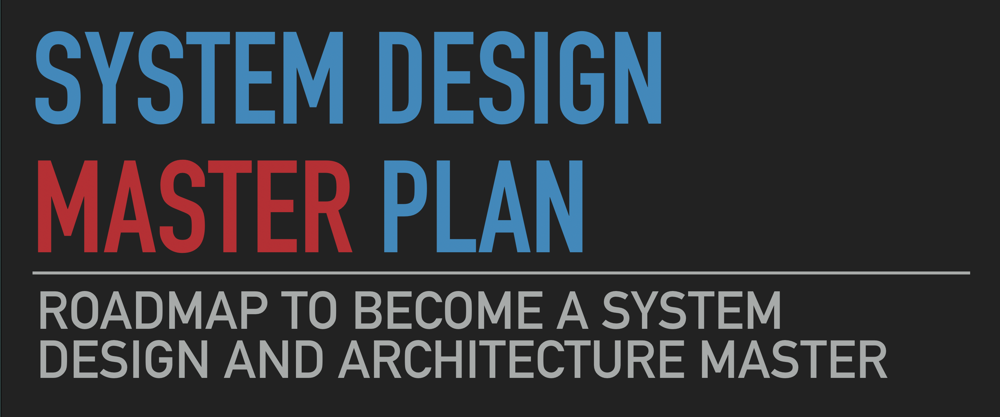
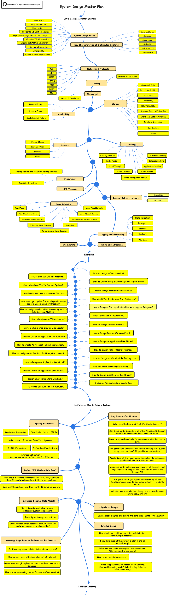

> System Design (Large Scale Design) is one of the areas that all engineers find challenging, and they always struggle to learn, design, and solve real system design problems. I created this chart as a roadmap for all engineers to learn large-scale design faster and become a better engineer.

